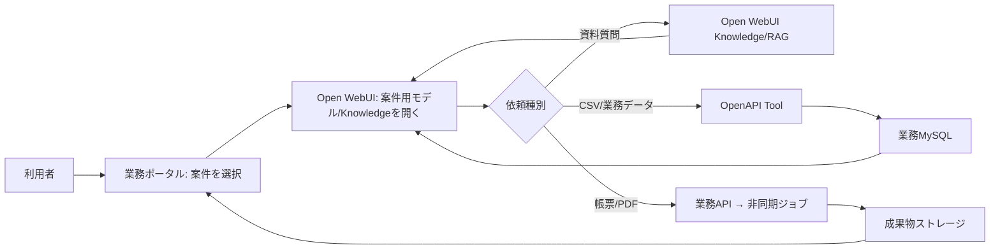

# 画面・操作・ユーザーフロー

## 現行画面の読み替え

現行 `support.php` は、案件一覧、案件中心タブ、チャットを一画面にまとめています。新構成ではこの画面を再現せず、会話は Open WebUI、案件の編集・一覧は必要最小限の独自ポータルへ分離します。

| 現行の操作 | 新構成の置き場（提案） |
| --- | --- |
| ログイン、モデル選択、会話履歴、通常チャット、ファイル添付 | Open WebUI 標準 |
| 案件作成/編集、案件切替、所在地/期間/状態 | 独自フロントエンド（業務ポータル） |
| 資料・ナレッジの検索と会話への添付 | Open WebUI Knowledge / ファイル管理 |
| 案件ごとの資料メモ作成・承認・版管理 | 独自フロントエンド + 業務API。必要なら公開版のみKnowledgeへ同期 |
| CSV一覧、プレビュー、取込、集計結果の保存 | 独自フロントエンド + 業務API |
| CSV集計・外部DB検索・帳票生成 | OpenAPI Tool 経由でFastAPIを呼ぶ |
| 回答の図/帳票/CSV化 | Open WebUIのAction/Tool起点 + 業務API。成果物一覧は独自ポータル |

## UI/UX 方針

### 現行UIから抽出する価値（確認済み）

現行 `support.php` では、案件一覧、案件の中心タブ、チャットを同一画面に置き、中心タブには概要、資料メモ、PDF、コメント、CSV、FAQ、メンバー、運用メモがあります。チャットにはスレッド切替と、フル思考・図解・報告書・CSV化の回答モードがあります。

新プロジェクトでは画面構成を引き継がず、次の体験だけを残します。

- 今どの案件を対象にしているかが常に分かる
- 資料、データ、会話、生成済み成果物へ迷わず行き来できる
- 重い処理の進捗・失敗・再実行を確認できる
- AIの回答と、DB集計・資料根拠・生成ファイルを取り違えない

### 推奨する画面分担（提案）

| 画面 | 主な利用者操作 | 実装先 |
| --- | --- | --- |
| 案件一覧 | 検索、状態確認、案件作成、案件を開く | 独自業務ポータル |
| 案件ホーム | 概要、参加者、資料/CSV/成果物の件数、未完了ジョブ | 独自業務ポータル |
| 資料・データ | アップロード、一覧、メタデータ、プレビュー、アクセス制御 | 独自業務ポータル。必要な資料をKnowledgeへ同期 |
| 分析・帳票 | CSV集計の実行/保存、生成ジョブの状態、成果物の閲覧/再生成 | 独自業務ポータル + FastAPI |
| AIチャット | 資料質問、要約、ツール実行、回答の確認 | Open WebUI |

### 最小の導線

```text
案件一覧 → 案件ホーム
              ├─ 資料・データを登録/確認
              ├─ AIチャットを開く（案件名・対象範囲を表示）
              └─ 成果物・ジョブを確認/再実行
```

### AIチャットのUX要件（提案）

- 案件名、利用可能な資料群、権限をチャット開始前に明示する。
- 「資料に質問」「CSVを集計」「報告書を作成」のような利用目的を、プロンプト例またはActionで選べるようにする。
- Tool実行時は、対象案件・対象ファイル・実行内容を回答の前に短く表示する。
- 回答には根拠の種類を表示する。例: `資料RAG`、`CSV集計結果`、`生成した報告書`。
- PDF生成やOCRなどの非同期処理は、受付完了とジョブIDを返し、完了待ちを会話ストリームで続けない。
- 権限不足、案件未選択、資料未登録、集計対象未指定は、曖昧な一般回答にせず次の操作を案内する。

### 視覚・操作上の原則（提案）

- **案件優先**: 画面上部に案件名と状態を固定表示し、案件をまたぐ操作は明示確認する。
- **成果物優先**: 会話本文より、保存された資料・CSV・PDFの名称、版、作成日時、作成者を追跡しやすくする。
- **状態を隠さない**: `受付済み / 実行中 / 完了 / 失敗 / 取消` を統一し、失敗時に利用者向けの要約を出す。
- **安全な既定値**: 破壊的な上書き、公開、外部DB更新は初期状態で無効にし、確認を求める。
- **アクセシビリティ**: 色だけで状態を伝えず、アイコン・テキスト・キーボード操作・十分なコントラストを併用する。

### Open WebUIとのUX境界

- Open WebUIのテーマ、レイアウト、内部画面をカスタマイズ前提にしない。
- 業務ポータルからOpen WebUIへ遷移する際は、対象案件の説明と利用可能なKnowledgeを見せる。URLパラメータだけで業務権限を渡さない。
- 独自画面が必要な一覧・承認・進捗・成果物管理はポータルに置く。Open WebUI内へのiframe埋込みやDOM操作は避ける。

## 基本フロー（提案）



## 利用者フロー

1. 利用者は業務ポータルで案件を選び、案件の権限と対象Knowledgeを確定する。
2. ポータルは Open WebUI の案件用モデル/会話への導線を提示する。案件IDはURLだけで信頼せず、業務APIがトークンまたはサーバー側のコンテキストで検証する。
3. 資料の質問はKnowledge/RAGを優先し、根拠リンク・ファイル名を回答に残す。
4. 集計・検索・登録などはモデルが業務Toolを呼ぶ。Toolは案件権限、許可操作、対象範囲を検査する。
5. 長時間の解析・PDF生成はジョブを作成して即時に受付を返し、ポータルで状態・結果・失敗理由を表示する。
6. 完成した資料、CSV、PDFは業務ポータルの成果物一覧へ保存する。必要な公開版だけをKnowledgeへ同期する。

## 図モード・報告書モード

- **図モード**: 小さな時系列・分布は業務APIが決定論的にChartデータを返す。説明図はOpen WebUIのMarkdown/Mermaidを使えるが、業務上の数値はTool結果を唯一の根拠にする。
- **報告書モード**: 会話本文をそのままPDFにせず、構造化した `ReportDraft`（結論、根拠、集計、留意点、出典、版）を生成し、利用者確認後にPDFジョブを実行する。
- **CSV化**: Markdown表の機械抽出だけに依存せず、集計Toolが返す構造化データからCSVを出力する。

## UX上の注意（提案）

- Open WebUIの更新によりDOMや内部画面が変わり得るため、案件一覧・成果物一覧をOpen WebUI画面へ埋め込む設計にしない。
- 「会話に案件が選択されている」ことをUI表示し、案件未選択で業務Toolを実行できないようにする。
- 進捗・再実行・ダウンロード・権限エラーはチャットだけに閉じず、ポータル側でも確認可能にする。
